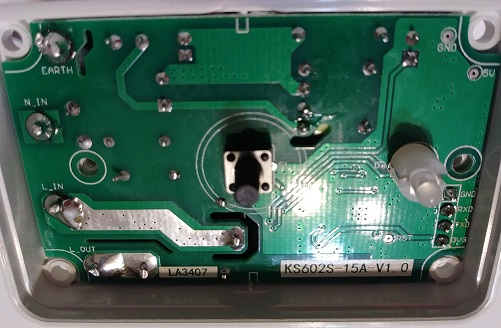

# KS-602S
Single gang wi-fi switch. To flash, simply undo 4 screws in the back and the 4 screws that are holding the PCB. 

[Link to Blakkader's repo](https://templates.blakadder.com/markevina_KS-602S.html)

### Template & GPIO Map

`{"NAME":"KS-602S","GPIO":[32,1,0,1,0,0,0,0,224,288,0,0,0,0],"FLAG":0,"BASE":18}`
| GPIO # | Component |
| ------ | --------- |
| GPIO00 | Button1   |
| GPIO01 | User      |
| GPIO02 | None      |
| GPIO03 | User      |
| GPIO04 | None      |
| GPIO05 | None      |
| GPIO09 | None      |
| GPIO10 | None      |
| GPIO12 | Relay1    |
| GPIO13 | Led1      |
| GPIO14 | None      |
| GPIO15 | None      |
| GPIO16 | None      |
| FLAG   | None      |

### Revision KS602S-15A-V1.0

Same GPIO map. This is a version with a micro-switch.

