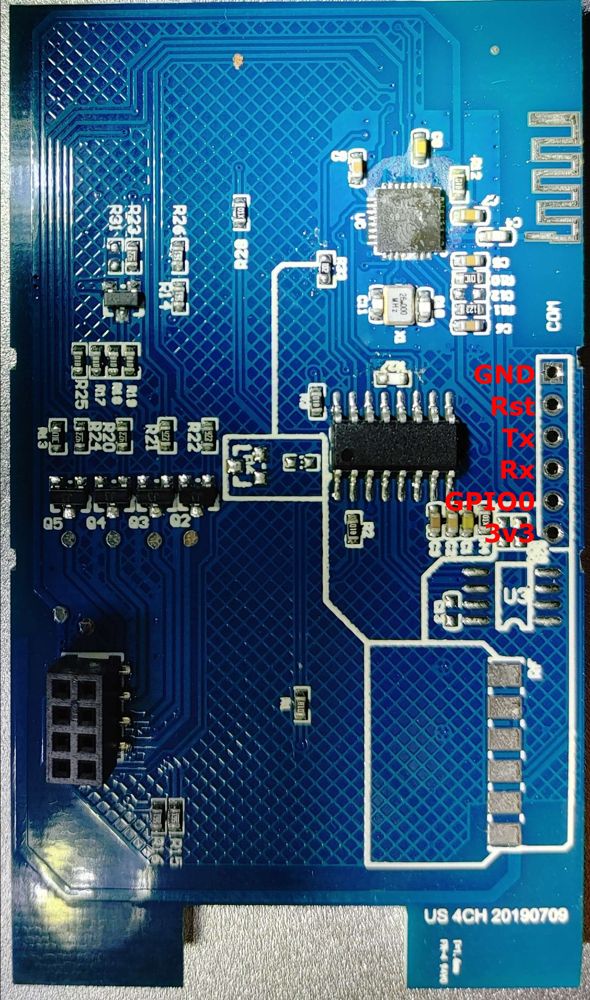
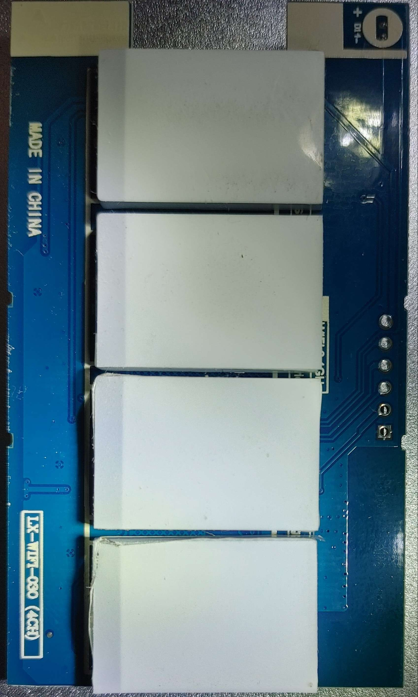

# LX-WIFI-03O
Single Gang Wifi switch. Comes in many forms, from 1 to 4 channels.

### Revision US 4CH 20190709
Sonata doesn't work like it used to with older revisions. There is a header will all the required signals. 

`{"NAME":"03O","GPIO":[32,0,0,0,226,225,33,34,224,260,35,227,0,0],"FLAG":0,"BASE":7}`

| GPIO # | Component |
| ------ | --------- |
| GPIO00 | Button1   |
| GPIO01 | User      |
| GPIO02 | None      |
| GPIO03 | User      |
| GPIO04 | None      |
| GPIO05 | None      |
| GPIO09 | None      |
| GPIO10 | None      |
| GPIO12 | Relay1    |
| GPIO13 | Led1      |
| GPIO14 | None      |
| GPIO15 | None      |
| GPIO16 | None      |
| FLAG   | None      |

 
